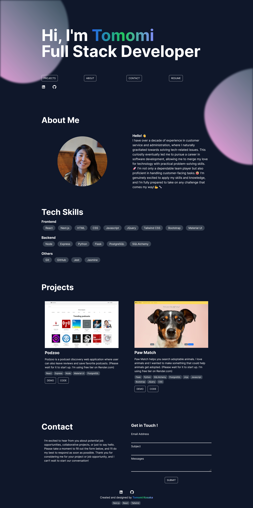

# My Portfolio Site ⭐
Live site: [Tomomi Kosaka Portfolio](https://tomomi-kosaka.vercel.app/)


# Features
- Responsive website
- Some scroll animations
- Contact Form using [Formspree](https://formspree.io/)

# Built with
- Next.js
- React
- Tailwind
- [AOS](https://michalsnik.github.io/aos/) 

# Run it on your local computer

First, run the development server:

```bash
npm run dev
# or
yarn dev
# or
pnpm dev
# or
bun dev
```

Open [http://localhost:3000](http://localhost:3000) with your browser to see the result.


